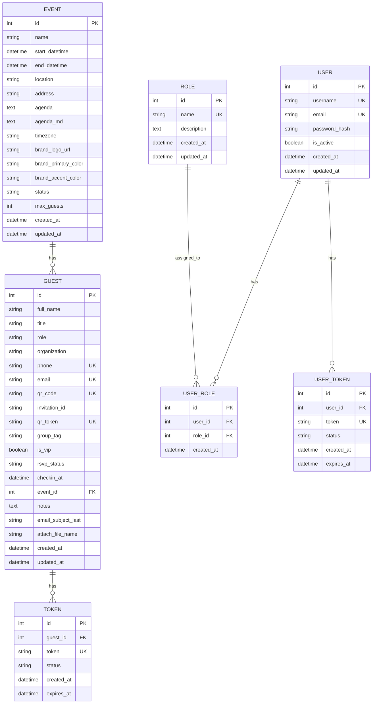

# Entity Relationship Diagram (ERD) - Version 1.0

## Tổng quan

Hệ thống quản lý khách mời sự kiện với các bảng chính: Events, Guests, Users, Roles và các bảng liên kết.

## Sơ đồ ERD

## Chi tiết các bảng

### 1. Bảng `events`

| Cột | Kiểu | Nullable | Mặc định | Mô tả |
|-----|------|----------|----------|-------|
| id | INTEGER | NO | AUTO_INCREMENT | Khóa chính |
| name | VARCHAR(255) | NO | - | Tên sự kiện |
| start_datetime | DATETIME | NO | - | Thời gian bắt đầu |
| end_datetime | DATETIME | YES | NULL | Thời gian kết thúc |
| location | VARCHAR(255) | YES | NULL | Địa điểm |
| address | VARCHAR(512) | YES | NULL | Địa chỉ chi tiết |
| agenda | TEXT | YES | NULL | Chương trình (text) |
| agenda_md | TEXT | YES | NULL | Chương trình (markdown) |
| timezone | VARCHAR(50) | YES | 'Asia/Ho_Chi_Minh' | Múi giờ |
| brand_logo_url | VARCHAR(1024) | YES | NULL | URL logo thương hiệu |
| brand_primary_color | VARCHAR(7) | YES | NULL | Màu chủ đạo (#RRGGBB) |
| brand_accent_color | VARCHAR(7) | YES | NULL | Màu nhấn (#RRGGBB) |
| status | VARCHAR(20) | YES | 'upcoming' | Trạng thái sự kiện |
| max_guests | INTEGER | YES | 100 | Số khách tối đa |
| created_at | DATETIME | YES | CURRENT_TIMESTAMP | Thời gian tạo |
| updated_at | DATETIME | YES | CURRENT_TIMESTAMP | Thời gian cập nhật |

**Indexes:**
- `ix_events_id` trên `id`
- `ix_events_name` trên `name`
- `ix_events_start_datetime` trên `start_datetime`

### 2. Bảng `guests`

| Cột | Kiểu | Nullable | Mặc định | Mô tả |
|-----|------|----------|----------|-------|
| id | INTEGER | NO | AUTO_INCREMENT | Khóa chính |
| full_name | VARCHAR(200) | NO | - | Họ tên đầy đủ |
| title | VARCHAR(20) | YES | NULL | Danh xưng (Mr, Ms, Dr) |
| role | VARCHAR(255) | YES | NULL | Chức vụ |
| organization | VARCHAR(255) | YES | NULL | Tổ chức |
| phone | VARCHAR(50) | YES | NULL | Số điện thoại |
| email | VARCHAR(255) | YES | NULL | Email |
| qr_code | VARCHAR(128) | YES | NULL | Mã QR |
| invitation_id | VARCHAR(128) | YES | NULL | ID thiệp mời |
| qr_token | VARCHAR(128) | YES | NULL | Token QR |
| group_tag | VARCHAR(50) | YES | NULL | Nhãn nhóm |
| is_vip | BOOLEAN | YES | FALSE | VIP status |
| rsvp_status | VARCHAR(20) | YES | 'pending' | Trạng thái RSVP |
| checkin_at | DATETIME | YES | NULL | Thời gian check-in |
| event_id | INTEGER | NO | - | Khóa ngoại đến events |
| notes | TEXT | YES | NULL | Ghi chú |
| email_subject_last | VARCHAR(255) | YES | NULL | Tiêu đề email cuối |
| attach_file_name | VARCHAR(255) | YES | NULL | Tên file đính kèm |
| created_at | DATETIME | YES | CURRENT_TIMESTAMP | Thời gian tạo |
| updated_at | DATETIME | YES | CURRENT_TIMESTAMP | Thời gian cập nhật |

**Indexes:**
- `ix_guests_id` trên `id`
- `ix_guests_full_name` trên `full_name`
- `ix_guests_email` trên `email` (UNIQUE)
- `ix_guests_phone` trên `phone` (UNIQUE)
- `ix_guests_qr_code` trên `qr_code` (UNIQUE)
- `ix_guests_qr_token` trên `qr_token` (UNIQUE)
- `ix_guests_event_id` trên `event_id`
- `ix_guests_organization` trên `organization`
- `ix_guests_group_tag` trên `group_tag`
- `ix_guests_is_vip` trên `is_vip`
- `ix_guests_rsvp_status` trên `rsvp_status`
- `ix_guests_checkin_at` trên `checkin_at`
- `ix_guests_invitation_id` trên `invitation_id`

**Constraints:**
- `uq_guests_invitation_event` UNIQUE trên `(invitation_id, event_id)`
- `FK_guests_event_id` FOREIGN KEY `event_id` REFERENCES `events(id)` ON DELETE CASCADE

### 3. Bảng `users`

| Cột | Kiểu | Nullable | Mặc định | Mô tả |
|-----|------|----------|----------|-------|
| id | INTEGER | NO | AUTO_INCREMENT | Khóa chính |
| username | VARCHAR(150) | NO | - | Tên đăng nhập |
| email | VARCHAR(255) | YES | NULL | Email |
| password_hash | VARCHAR(255) | NO | - | Mã hash mật khẩu |
| is_active | BOOLEAN | YES | TRUE | Trạng thái hoạt động |
| created_at | DATETIME | YES | CURRENT_TIMESTAMP | Thời gian tạo |
| updated_at | DATETIME | YES | CURRENT_TIMESTAMP | Thời gian cập nhật |

**Indexes:**
- `ix_users_id` trên `id`
- `ix_users_username` trên `username` (UNIQUE)
- `ix_users_email` trên `email` (UNIQUE)

### 4. Bảng `roles`

| Cột | Kiểu | Nullable | Mặc định | Mô tả |
|-----|------|----------|----------|-------|
| id | INTEGER | NO | AUTO_INCREMENT | Khóa chính |
| name | VARCHAR(50) | NO | - | Tên vai trò |
| description | TEXT | YES | NULL | Mô tả |
| created_at | DATETIME | YES | CURRENT_TIMESTAMP | Thời gian tạo |
| updated_at | DATETIME | YES | CURRENT_TIMESTAMP | Thời gian cập nhật |

**Indexes:**
- `ix_roles_id` trên `id`
- `ix_roles_name` trên `name` (UNIQUE)

### 5. Bảng `user_roles`

| Cột | Kiểu | Nullable | Mặc định | Mô tả |
|-----|------|----------|----------|-------|
| id | INTEGER | NO | AUTO_INCREMENT | Khóa chính |
| user_id | INTEGER | NO | - | Khóa ngoại đến users |
| role_id | INTEGER | NO | - | Khóa ngoại đến roles |
| created_at | DATETIME | YES | CURRENT_TIMESTAMP | Thời gian tạo |

**Indexes:**
- `ix_user_roles_id` trên `id`
- `ix_user_roles_user_id` trên `user_id`
- `ix_user_roles_role_id` trên `role_id`

**Constraints:**
- `uq_user_roles_user_role` UNIQUE trên `(user_id, role_id)`
- `FK_user_roles_user_id` FOREIGN KEY `user_id` REFERENCES `users(id)` ON DELETE CASCADE
- `FK_user_roles_role_id` FOREIGN KEY `role_id` REFERENCES `roles(id)` ON DELETE CASCADE

### 6. Bảng `tokens`

| Cột | Kiểu | Nullable | Mặc định | Mô tả |
|-----|------|----------|----------|-------|
| id | INTEGER | NO | AUTO_INCREMENT | Khóa chính |
| guest_id | INTEGER | NO | - | Khóa ngoại đến guests |
| token | VARCHAR(128) | NO | - | Token |
| status | VARCHAR(20) | YES | 'active' | Trạng thái |
| created_at | DATETIME | YES | CURRENT_TIMESTAMP | Thời gian tạo |
| expires_at | DATETIME | YES | NULL | Thời gian hết hạn |

**Indexes:**
- `ix_tokens_id` trên `id`
- `ix_tokens_guest_id` trên `guest_id`
- `ix_tokens_token` trên `token` (UNIQUE)
- `ix_tokens_status` trên `status`

**Constraints:**
- `FK_tokens_guest_id` FOREIGN KEY `guest_id` REFERENCES `guests(id)` ON DELETE CASCADE

### 7. Bảng `user_tokens`

| Cột | Kiểu | Nullable | Mặc định | Mô tả |
|-----|------|----------|----------|-------|
| id | INTEGER | NO | AUTO_INCREMENT | Khóa chính |
| user_id | INTEGER | NO | - | Khóa ngoại đến users |
| token | VARCHAR(128) | NO | - | Token |
| status | VARCHAR(20) | YES | 'active' | Trạng thái |
| created_at | DATETIME | YES | CURRENT_TIMESTAMP | Thời gian tạo |
| expires_at | DATETIME | YES | NULL | Thời gian hết hạn |

**Indexes:**
- `ix_user_tokens_id` trên `id`
- `ix_user_tokens_user_id` trên `user_id`
- `ix_user_tokens_token` trên `token` (UNIQUE)
- `ix_user_tokens_status` trên `status`

**Constraints:**
- `FK_user_tokens_user_id` FOREIGN KEY `user_id` REFERENCES `users(id)` ON DELETE CASCADE

## Quan hệ giữa các bảng

1. **Event → Guest**: Một sự kiện có nhiều khách mời (1:N)
2. **User → UserRole**: Một user có thể có nhiều vai trò (1:N)
3. **Role → UserRole**: Một vai trò có thể được gán cho nhiều user (1:N)
4. **Guest → Token**: Một khách có thể có nhiều token (1:N)
5. **User → UserToken**: Một user có thể có nhiều token (1:N)

## Ràng buộc dữ liệu

- `rsvp_status` ∈ {'pending', 'accepted', 'declined'}
- `status` (events) ∈ {'upcoming', 'ongoing', 'completed', 'cancelled'}
- `status` (tokens) ∈ {'active', 'revoked'}
- `is_vip` ∈ {TRUE, FALSE}
- `is_active` (users) ∈ {TRUE, FALSE}

## Diff so với version trước

- **Version 1.0**: Thiết kế ban đầu với đầy đủ các bảng và ràng buộc
- Thêm các trường branding cho events
- Thêm hệ thống phân quyền với users/roles
- Thêm hệ thống token cho guests và users
- Cải thiện cấu trúc dữ liệu cho invitation system
